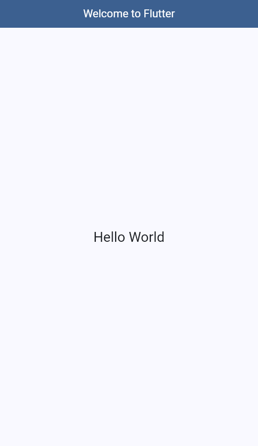

# CineCatálogo

Aplicación móvil de catálogo de películas desarrollada en Flutter.

- **Participante:** Tatiana Montenegro Domínguez
- **Asignatura:** Programación Móvil
- **Asesor(a):** Gabriel Peralta Domínguez

## Actividad: primera aplicación en Flutter ("Hello World")

Pantalla inicial con el título **"Welcome to Flutter"** en la barra superior y el texto **"Hello World"** en el centro de la pantalla.



El código está en [`lib/main.dart`](lib/main.dart):

- `MaterialApp` con el título de la app y un tema de Material 3 con el azul de la línea de diseño (`#14477E`).
- `Scaffold` con un `AppBar` cuyo título es `Welcome to Flutter`.
- `Center` con el `Text('Hello World')` como cuerpo de la pantalla.

### Material de apoyo

- [Tu primera app de Flutter (codelab oficial)](https://codelabs.developers.google.com/codelabs/flutter-codelab-first?hl=es-419#0)

## Cómo ejecutar

```bash
flutter pub get
flutter run          # en un emulador o dispositivo conectado
flutter test         # prueba que verifica el título y el texto
flutter analyze      # análisis estático (sin errores)
```

Probado con Flutter 3.47.6 (Dart 3.13.5).
